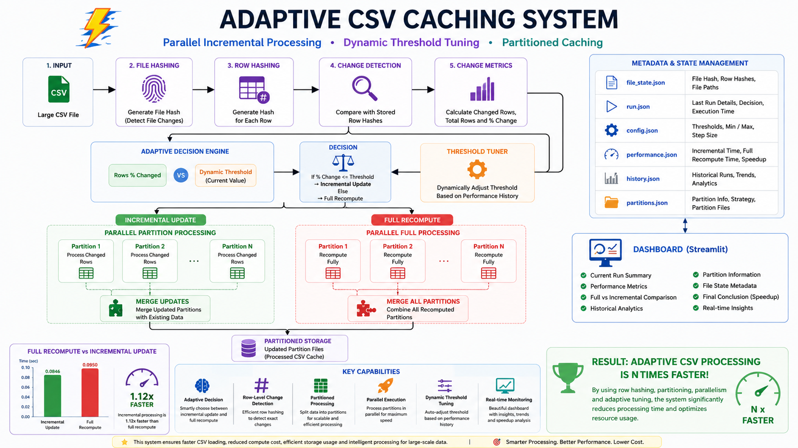
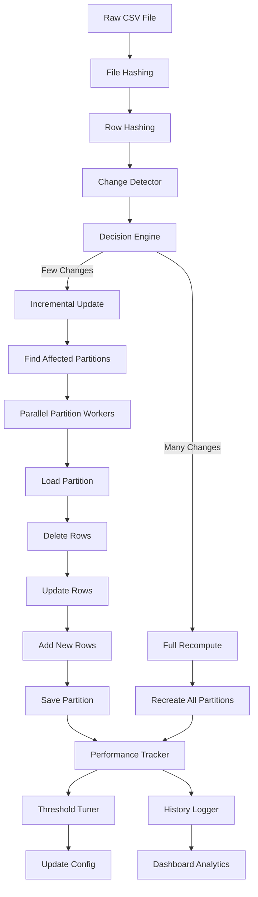

# ⚡ Adaptive CSV Cache Engine



## 🏗️ System Architecture Overview

The architecture diagram above illustrates the complete workflow of the Adaptive CSV Cache Engine.

The system begins by loading a raw CSV file and generating:

* file-level hashes
* row-level hashes

These hashes are compared against previously stored metadata to detect:

* updated rows
* new rows
* deleted rows

The Change Detector sends the computed change metrics to the Adaptive Decision Engine.

The Decision Engine dynamically decides whether to:

```text
1. Run Incremental Update
OR
2. Run Full Recompute
```

based on:

* percentage of changed rows
* current adaptive threshold
* historical runtime performance

If incremental update is selected:

* only affected partitions are processed
* partitions are updated in parallel
* unnecessary recomputation is avoided

If full recompute is selected:

* all partitions are rebuilt
* metadata is refreshed completely

The Threshold Tuner continuously adjusts the threshold dynamically based on:

```text
real execution performance
```

allowing the system to adapt automatically to changing workloads.

All execution metadata is tracked using:

* run.json
* history.json
* performance.json
* partitions.json
* file_state.json

The Streamlit Dashboard provides:

* real-time monitoring
* execution analytics
* threshold trends
* performance comparison
* historical insights

This architecture transforms traditional CSV processing into an adaptive partition-aware incremental processing engine optimized for performance and scalability.

---

## 🚀 Overview

Adaptive CSV Cache Engine is a high-performance intelligent CSV processing system designed to optimize repeated CSV operations using:

* Incremental Updates
* Dynamic Threshold Tuning
* Partitioned Storage
* Parallel Partition Execution
* File Hashing
* Row Hashing
* Historical Analytics
* Performance Monitoring Dashboard

Instead of recomputing an entire CSV file after every small modification, the system intelligently detects changes and updates only the affected partitions.

---

# 🎯 Problem Statement

Traditional CSV processing systems usually:

* Reprocess the entire file
* Consume unnecessary I/O
* Waste CPU resources
* Scale poorly for repeated small updates

This project solves that problem by introducing:

```text
Adaptive Incremental CSV Processing
```

The system dynamically decides whether to:

```text
1. Run Full Recompute
OR
2. Run Incremental Partition Updates
```

based on real runtime performance.

---

# 🧠 Core Features

## ✅ File Hashing

Detects whether the CSV file changed.

---

## ✅ Row Hashing

Detects:

* Updated rows
* New rows
* Deleted rows

using row-level MD5 hashing.

---

## ✅ Intelligent Decision Engine

Dynamically decides:

```text
Incremental Update
OR
Full Recompute
```

based on:

* percentage of changed rows
* adaptive threshold
* historical performance

---

## ✅ Dynamic Threshold Tuning

The threshold automatically adjusts based on:

```text
actual execution performance
```

Example:

```text
If incremental becomes slower:
    threshold decreases

If incremental becomes faster:
    threshold increases
```

---

## ✅ Partitioned Storage

The CSV is split into multiple partition files:

```text
part_0.csv
part_1.csv
part_2.csv
...
```

using hash-based partitioning.

---

## ✅ Parallel Partition Updates

Affected partitions are updated in parallel using:

```python
ThreadPoolExecutor
```

which significantly improves performance for multi-partition workloads.

---

## ✅ Historical Analytics

All executions are tracked using:

```text
history.json
```

allowing trend analysis.

---

## ✅ Real-Time Dashboard

A professional Streamlit dashboard visualizes:

* execution metrics
* threshold evolution
* performance comparison
* partition metadata
* historical trends
* incremental vs full recompute comparison

---

# 🏗️ Complete Architecture



---

# ⚙️ Project Workflow

## Step 1 — Load CSV

The system loads the raw CSV file.

---

## Step 2 — Generate File Hash

An MD5 hash is generated for the entire file.

Purpose:

```text
Detect whether the file changed.
```

---

## Step 3 — Generate Row Hashes

Each row receives its own MD5 hash.

Purpose:

```text
Detect row-level changes.
```

---

## Step 4 — Change Detection

The engine identifies:

* updated rows
* new rows
* deleted rows

---

## Step 5 — Decision Engine

The engine calculates:

```text
rows_percentage_change
```

and compares it with:

```text
current_threshold
```

Then decides:

```text
incremental_update
OR
full_recompute
```

---

## Step 6 — Partition Processing

### Incremental Update

Only affected partitions are updated.

### Full Recompute

All partitions are recreated.

---

## Step 7 — Parallel Execution

Affected partitions are processed in parallel.

---

## Step 8 — Performance Tracking

Execution timings are recorded.

---

## Step 9 — Dynamic Threshold Tuning

Threshold adapts automatically based on:

```text
actual execution performance
```

---

## Step 10 — Historical Logging

All runs are stored in:

```text
history.json
```

---

## Step 11 — Dashboard Visualization

The dashboard displays:

* trends
* comparisons
* performance metrics
* analytics

---

# 📂 Project Structure

```text
csv-cache-system/
│
├── data/
│   ├── raw/
│   │   └── Titanic-Dataset.csv
│   │
│   └── processed/
│       └── partitions/
│           ├── part_0.csv
│           ├── part_1.csv
│           ├── part_2.csv
│           └── ...
│
├── metadata/
│   ├── config.json
│   ├── file_state.json
│   ├── history.json
│   ├── performance.json
│   ├── partitions.json
│   └── run.json
│
├── src/
│   ├── cache/
│   ├── dashboard/
│   ├── decision/
│   ├── hashing/
│   ├── pipeline/
│   ├── utils/
│   └── main.py
│
└── README.md
```

---

# 📊 Metadata Files

## config.json

Stores:

* current threshold
* min threshold
* max threshold
* tuning step size

---

## file_state.json

Stores:

* last file hash
* row hashes
* processed path
* identifier columns

---

## performance.json

Stores:

* last incremental execution time
* last full recompute execution time

---

## history.json

Stores complete execution history.

---

## partitions.json

Stores:

* partition metadata
* partition strategy
* partition folder path
* partition files

---

# ⚡ Parallel Processing Design

The engine uses:

```python
ThreadPoolExecutor
```

to process partitions in parallel.

Example:

```text
Affected Partitions:
{0, 2, 3}
```

Instead of:

```text
Sequential:
part_0 → part_2 → part_3
```

it runs:

```text
Parallel:
part_0
part_2
part_3
```

simultaneously.

---

# 📈 Dashboard Features

## Current Run Summary

Displays:

* execution type
* execution time
* changed rows
* threshold used

---

## Performance Metrics

Displays:

* incremental update time
* full recompute time
* speedup factor

---

## Historical Analytics

Visualizes:

* execution trends
* threshold evolution
* execution type distribution
* rows changed trends

---

## Partition Analytics

Displays:

* total partitions
* partition strategy
* partition files

---

# 🧪 Example Output

```text
Decision: incremental_update
Updated Rows: ['2', '3']
Affected Partitions: {0, 3}
Running Parallel Partitioned Incremental Update...
Partition 0 updated successfully.
Partition 3 updated successfully.
```

---

# 🚀 Performance Improvement

The engine achieved:

```text
Incremental Update Time:
0.084 sec

Full Recompute Time:
0.095 sec
```

Meaning:

```text
Incremental processing became faster than full recomputation.
```

---

# 🧠 Key Engineering Concepts Used

## Data Engineering

* Incremental Processing
* Partitioned Storage
* Parallel Execution
* Metadata Management
* Adaptive Systems

---

## Distributed Systems Concepts

* Hash Partitioning
* Workload Distribution
* Parallel Workers
* Execution Optimization

---

## Performance Engineering

* Dynamic Threshold Tuning
* Runtime Optimization
* Incremental Processing
* Adaptive Decision Systems

---

# 🛠️ Technologies Used

* Python
* Pandas
* Streamlit
* JSON
* ThreadPoolExecutor
* MD5 Hashing

---

# 📂 Get the Dataset

- Go to the below link
   - [Titanic Dataset on Kaggle](https://www.kaggle.com/datasets/yasserh/titanic-dataset)  

- Download the dataset inside the directory **data/raw**

---

# 📥 Clone the Repository

```bash
git clone https://github.com/RiddhiDhara/csv-cache-system
```

---

# 📂 Navigate into the Project

```bash
cd csv cache system
```

---

# 📦 Install Dependencies

Create a requirements.txt file:

```text
pandas
streamlit
```

Then install dependencies:

```bash
pip install -r requirements.txt
```

---

# 🔄 Resetting the Project State ( optional but recommended )

If you want to restart the engine from a clean state, reset the following files inside the `metadata/` folder.

## Reset These Files

### config.json

```json
{
    "current_threshold": 0.2,
    "min_threshold": 0.05,
    "max_threshold": 0.9,
    "step_size": 0.05
}
```

---

### performance.json

```json
{
    "last_incremental_time": null,
    "last_full_recompute_time": null
}
```

---

### history.json

```json
{
    "history": []
}
```

---

### run.json

```json
{
    "decision": null,
    "actual_execution": null,
    "rows_percentage_change": null,
    "changed_rows": null,
    "total_rows": null,
    "execution_time": null,
    "threshold_used": null,
    "timestamp": null
}
```

---

### partitions.json

```json
{}
```

---

### file_state.json

```json
{
    "input_file_path": "",
    "last_file_hash": "",
    "processed_file_path": "",
    "row_identifier_columns": ["PassengerId"],
    "row_hashes": {}
}
```

---

# 🗑️ Remove Processed Partitions

Delete all files inside:

```text
data/processed/partitions/
```

Example:

```text
part_0.csv
part_1.csv
part_2.csv
...
```

The system will automatically recreate them during the next full recompute.

---

This will regenerate once you run the project:
- partitions
- metadata
- performance metrics
- history tracking

---


# ▶️ Run the Project

## Install Dependencies

```bash
pip install pandas streamlit
```

---

## Run Main Pipeline

```bash
python -m src.main
```

---

## Run Dashboard

```bash
streamlit run src/dashboard/dashboard.py
```

---

# 🏁 Conclusion

Adaptive CSV Cache Engine successfully demonstrates:

* intelligent incremental processing
* partition-aware execution
* dynamic performance tuning
* parallel partition updates
* historical execution analytics

The project evolves beyond simple CSV processing into:

```text
an adaptive distributed-style incremental processing engine
```

capable of optimizing workloads based on real runtime behavior.
